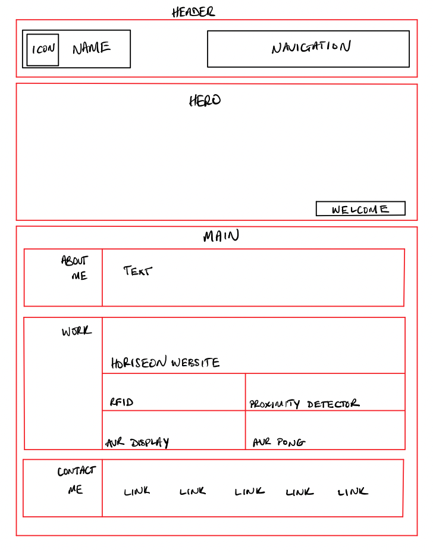
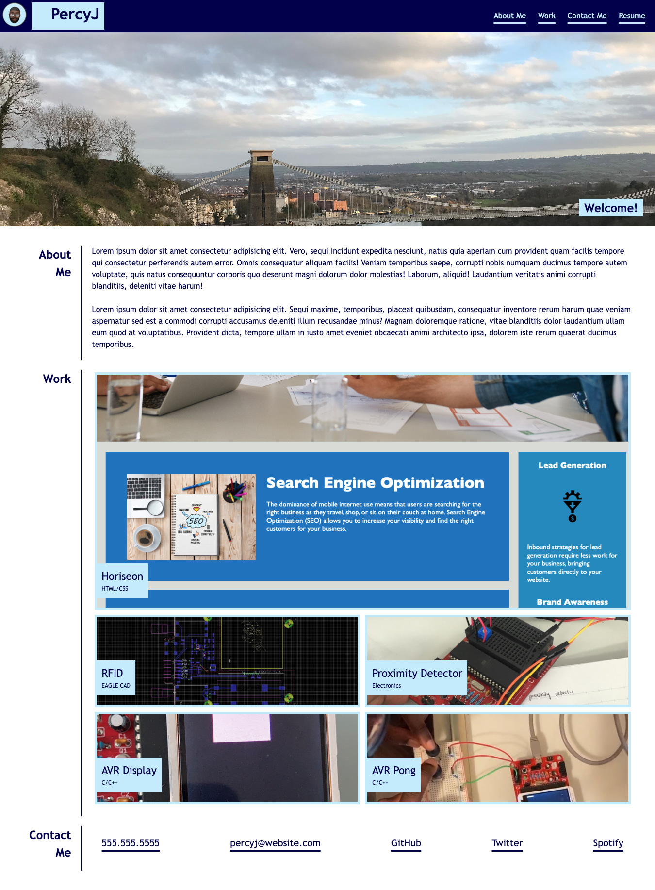
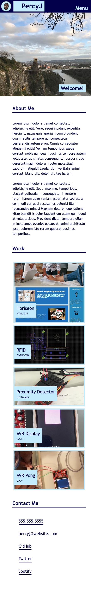

# Module-2-Challenge
## Working With CSS Challenge: Portfolio

This Challenge is a culmination of everything I have learnt so far about HTML and CSS. It demonstrates usage of flexbox and grids.
It also showcases the structural advantages and simplicity grids add to the CSS code. I also made use of a wireframe when planning out
the layout and functionality of my website

# Challenges

The main challenge was understanding when and how to use grids. I found out the hard way that it can be very diffcult to get the grid organised as you want if you dont properly define the grid items and how you want them to be placed.

# Things I learned

I learnt the power of CSS grids! I also learnt a lot of new things in undertaking this Portfolio challenge such as animations. I learnt how to use the hover pseudo-class and a change of colours to create a highlighting animation.
Most of all, I learnt the importance of a wireframe.

# Wireframe

# Website Screenshot

## Fullsize

## Media Query in effect:

# Installation

N/A

# Usage

To use this [Portfolio Website](https://percyjacks.github.io/Module-2-Challenge/), you can click the sections in the navigation bar and it will take you to the corresponding section on the website. (Note clicking Resume will download a pdf.)

# Credits

N/A

# License

Please refer to the LICENSE in the repo.

# Contact

If you have any questions, please contact me at:

Github: [PercyJacks](https://github.com/PercyJacks)
